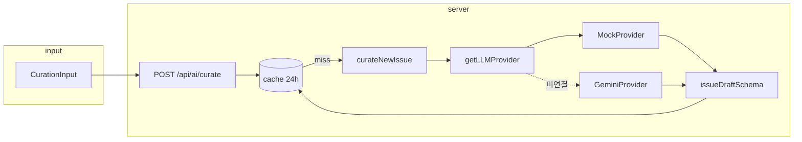

# 패션맵 v2 — 개발 현황 & 기획 점검용 핸드오프

> **목적**: 다른 AI(또는 리뷰어)에게 **기획·아키텍처·구현 상태**를 한 번에 전달하고,  
> PRD/SPRINTS 대비 **갭·리스크·다음 결정**에 대한 피드백을 받기 위한 문서입니다.  
> **작성 기준일**: 2026-05-20 (Sprint 1 진행 중, 백엔드 파이프라인 대부분 완료)

---

## 1. 리뷰어에게 드리는 질문 (점검 포인트)

아래 항목에 대해 **비판적으로** 의견을 주세요.

1. **기획**: 학습·포트폴리오 목표에 비해 Sprint 1 범위가 적절한가? 과한가/부족한가?
2. **아키텍처**: Provider 추상화 + Zod + Gemini Structured Output 이중 검증이 과설계인가, 학습 목표에 맞는가?
3. **데이터 모델**: `IssueDraft`가 `EditorialIssue`의 부분집합으로 설계된 것이 Sprint 2(파일 발행)까지 자연스러운가?
4. **정책 필터**: AI가 만든 콘텐츠가 최종적으로 `fetchNaverProductsPage`를 거쳐야 한다는 PRD 원칙 — 현재 Sprint 1에서는 **아직 연결 안 됨**. 이 순서가 맞는가?
5. **운영·비용**: 24h 메모리 캐시만 있고 일일 호출 가드는 미구현. 우선순위가 맞는가?
6. **미완**: `client.ts`가 gemini 선택 시 아직 throw, `@google/generative-ai` 미설치. Sprint 1 DoD를 “완료”로 볼 수 있는가?

---

## 2. 프로젝트 한 줄 + 성공 정의

| 항목 | 내용 |
|------|------|
| **정체성** | 2014년 안드로이드 패션맵을 2026년 AI 웹앱으로 부활 — **AI 통합 production 경험** 학습 |
| **성격** | 학습·포트폴리오. 사용자·수익·마케팅 목표 **없음** |
| **성공 정의** | 면접에서 AI 통합·결정·트레이드오프를 **5분** 설명 가능 |
| **스택** | Next.js 16 (App Router), React 19, Tailwind v4, TypeScript 5 |
| **LLM** | Google Gemini (`gemini-2.5-pro` 예정), 개발 기본값 `LLM_PROVIDER=mock` |

**참고 문서**: `docs/PRD.md`, `docs/SPRINTS.md`, `AGENTS.md`, `.cursor/rules/project.mdc`

---

## 3. 제품 범위 (기획 요약)

### 3.1 하지 않는 것 (PRD 고정)

- 챗 UI, 사진 분석, 사용자 인증, i18n, Eval 셋, archive 페이지 등 (원래 Sprint 3–4)

### 3.2 하는 것 (2주 압축)

| Sprint | 목표 | 화면 변화 |
|--------|------|-----------|
| **Sprint 1** (1주) | AI가 `EditorialIssue` 형태의 **IssueDraft JSON** 생성 파이프라인 | **없음** (백엔드·CLI·admin 테스트만) |
| **Sprint 2** (1주) | `data/issues/*.json` 발행, 홈이 최신 이슈 반영 | **있음** (새 VOL 표시) |

### 3.3 핵심 사용자 스토리 (최종 비전)

> AI가 매주 매거진 이슈를 생성 → JSON 파일로 저장(git) → 홈 `EditorialIssue`가 갱신.

현재는 **생성 파이프라인까지만** 구현. 홈은 여전히 `lib/editorial.ts`의 `CURRENT_ISSUE` 하드코딩.

---

## 4. 기존 앱 (Sprint 1 이전·병행 유지)

AI 작업과 **독립**으로 이미 있는 기능:

- 네이버 쇼핑 API 검색 (`lib/api.ts`) + 몰 정책·리스팅 가드·타이틀 sanitize
- 홈: Hero, AtlasSection, EditorialSection(브랜드/테마/saved-ai), BrandIndex
- Feed, Search, Saved, Product 상세, My
- localStorage 기반 saved/follow
- Admin: `/admin/ai-test` (Mock 큐레이터 수동 테스트 UI)

---

## 5. Sprint 1에서 새로 만든 것 (AI 큐레이터)

### 5.1 파일 맵

```
lib/ai/
  types.ts              # LLMProvider, CurationInput, IssueDraft
  schema.ts             # issueDraftSchema (Zod)
  client.ts             # getLLMProvider() — mock만 동작, gemini는 throw
  curator.ts            # curateNewIssue(): 호출·검증·1회 재시도·fallback
  cache.ts              # 입력 SHA-256 해시 → 24h 메모리 캐시
  prompts/
    issue-editor.ts     # system/user 프롬프트 메시지 생성
  providers/
    mock.ts             # 결정론적 MockProvider + schema.parse
    gemini.ts           # GeminiProvider (SDK 동적 import, Structured JSON)

app/api/ai/curate/
  route.ts              # POST — 캐시 + curateNewIssue

app/admin/ai-test/
  page.tsx              # Server Component 폼·결과 UI
  actions.ts            # Server Action → MockProvider → 쿠키 플래시

scripts/
  test-mock-curator.ts  # npm run test:mock
  test-curator.mjs      # curateNewIssue CLI
```

### 5.2 데이터 모델

- **입력 `CurationInput`**: `issueMeta`(vol, season, date, city), `trendSignals[]`, `candidateProducts[]`(Product), `maxSections?`, `locale?`
- **출력 `IssueDraft`**: `EditorialIssue` 필드 중 발행 초안에 필요한 부분 + `sections[]` (`IssueDraftSection`)
- **최종 목표 타입**: `EditorialIssue` (`lib/editorial.ts`) — Sprint 2에서 JSON 파일로 영속화

`vol`은 **string** (예: `"07"`, `"08"`). number 아님.

### 5.3 처리 파이프라인



**curator.ts 동작**

1. `getLLMProvider()` (또는 주입 provider)
2. `generateIssueDraft()` 호출
3. `issueDraftSchema.parse()` — 실패 시 최대 **1회** 재시도
4. 그래도 실패 시 **fallback** 초안 생성 후 다시 parse

**mock.ts 동작**

- 같은 입력 → 같은 출력 (결정론적)
- 첫 섹션: `candidateProducts`에서 추출한 `brandSlug`
- 나머지: `trendSignals` 기반 theme 섹션

**gemini.ts 동작 (코드 존재, E2E 미완)**

- `GOOGLE_AI_API_KEY` 필수
- `@google/generative-ai` **동적 import** (패키지 없으면 명시적 에러)
- `responseMimeType: application/json` + `responseSchema`
- 응답 JSON → `issueDraftSchema.parse()`

### 5.4 API 계약

**`POST /api/ai/curate`**

요청 예시:

```json
{
  "issueMeta": { "vol": "08", "season": "FW26", "date": "05 · 07 · 26", "city": "SEOUL" },
  "trendSignals": ["캐시미어", "미니멀"],
  "candidateProducts": [
    {
      "id": "p-1",
      "name": "Hermes cashmere coat",
      "mall": "네이버",
      "price": 1200000,
      "imageUrl": "https://example.com/p1.jpg",
      "link": "https://example.com/p1"
    }
  ],
  "maxSections": 3,
  "options": { "maxOutputTokens": 1024, "temperature": 0 }
}
```

성공:

```json
{ "ok": true, "cached": false, "data": { /* IssueDraft */ } }
```

캐시 hit:

```json
{ "ok": true, "cached": true, "data": { /* IssueDraft */ } }
```

### 5.5 Admin 테스트 UI

- URL: `/admin/ai-test`
- 폼: city (SEOUL/TOKYO/MILANO), season (FW26/SS27), trendSignals(콤마 구분)
- Server Action → **MockProvider 직접** (아직 `getLLMProvider` / curator 경유 아님)
- 결과: 메타, 섹션 리스트, Raw JSON (`<details>`)
- 인증 없음 (학습용; robots 차단은 추후)

### 5.6 CLI

| 명령 | 설명 |
|------|------|
| `npm run test:mock` | MockProvider 단독 |
| `npx tsx scripts/test-curator.mjs` | `curateNewIssue` 전체 (mock) |

---

## 6. 환경 변수 & 보안 (AGENTS.md)

| 변수 | 용도 |
|------|------|
| `NAVER_CLIENT_ID` / `NAVER_CLIENT_SECRET` | 네이버 쇼핑 (기존) |
| `GOOGLE_AI_API_KEY` | Gemini (서버 전용) |
| `LLM_PROVIDER` | `mock` \| `gemini` |

- API 키 **클라이언트 노출 금지** (`NEXT_PUBLIC_` 사용 안 함)
- `@google/generative-ai` import는 **`lib/ai/providers/gemini.ts` 안에서만**

---

## 7. Sprint 1 DoD 체크리스트 (현재 상태)

| 항목 | 상태 | 비고 |
|------|------|------|
| mock CLI로 IssueDraft 출력 | ✅ | `npm run test:mock`, `test-curator.mjs` |
| gemini 실키로 검증 통과 JSON | ⬜ | SDK 미설치, `client.ts` 미연결 |
| 동일 입력 2회 캐시 hit | ⬜ | API는 구현됨, 수동 검증 필요 |
| 검증 실패·fallback 동작 | ⬜ | 코드 있음, 케이스 테스트 필요 |
| 홈 화면 영향 0 | ✅ | `CURRENT_ISSUE` 유지 |

---

## 8. 알려진 갭·기술 부채

1. **`lib/ai/client.ts`**: `LLM_PROVIDER=gemini` 시 `GeminiProvider` 대신 throw (주석: “구현 전” — 실제로는 `gemini.ts` 존재)
2. **`package.json`**: `@google/generative-ai`, `zod`가 dependencies에 **명시 없음** — `zod`는 Next/transitive로 동작 중일 수 있음, gemini는 **미설치**
3. **`package.json`**: `test:curator` 스크립트 없음 (`test-curator.mjs`는 수동 `npx tsx`)
4. **admin ai-test**: `curateNewIssue` / 캐시 / `getLLMProvider` 미사용 — MockProvider 직접 호출
5. **일일 호출 가드**: PRD/AGENTS에 언급, **미구현**
6. **프롬프트**: `curator.ts`에서 `buildIssueEditorPrompt` 호출하지만 `void` 처리 — Gemini 연결 시 provider 내부에서만 사용
7. **정책 필터**: AI 출력 상품이 네이버 API·`mall-policy` 파이프를 타는 흐름 — **Sprint 2 이후** 예정
8. **캐시**: 프로세스 메모리 Map — 서버리스/멀티 인스턴스에서 공유 안 됨 (학습용으로는 OK)

---

## 9. Sprint 2 예정 (아직 미착수)

- `data/issues/vol-007.json` 마이그레이션 (하드코딩과 1:1)
- `getCurrentIssue()` server-only
- `scripts/publish-issue.mjs` / `npm run publish:issue`
- AI 발행 vol-008 → 홈 반영
- 커버 이미지: AI URL 환각 방지용 **검증된 풀**에서만 선택

---

## 10. 아키텍처 원칙 (코딩 시 지켜야 할 것)

1. LLM 호출은 서버만 (`app/api/ai/*`, Server Actions, scripts)
2. Provider는 `getLLMProvider()` 또는 `LLMProvider` 인터페이스로만
3. LLM raw output 신뢰 금지 → Zod (+ Gemini responseSchema)
4. 재시도 최대 1회, 캐시 24h
5. Next 16 / React 19 / Tailwind v4 — `pages/`, `getServerSideProps` 등 레거시 금지
6. 새 npm 패키지는 최소화·정당화

---

## 11. 로컬 실행

```bash
npm install
cp .env.local.example .env.local   # 키 채우기
# .env.local 예: LLM_PROVIDER=mock

npm run dev          # http://localhost:3000
npm run test:mock    # MockProvider CLI
npx tsx scripts/test-curator.mjs
```

확인 URL:

- 홈: http://localhost:3000
- AI admin: http://localhost:3000/admin/ai-test

---

## 12. 변경 이력 (이 문서)

| 날짜 | 내용 |
|------|------|
| 2026-05-20 | Sprint 1 구현 현황 기준 최초 작성 (다른 AI 기획 점검용) |

---

## 13. 부록: Mock 출력 예시 (검증됨)

`city=SEOUL`, `trendSignals=캐시미어, 미니멀, 뉴트럴 톤` 기준:

- `title`: `Mock issue for SEOUL`
- `sections[0].source`: `{ "type": "brand", "brandSlug": "hermes-cashmere" }`
- `sections[1+]`: theme 쿼리로 trendSignals 순환

Admin UI 및 CLI에서 동일 구조 확인 완료.
